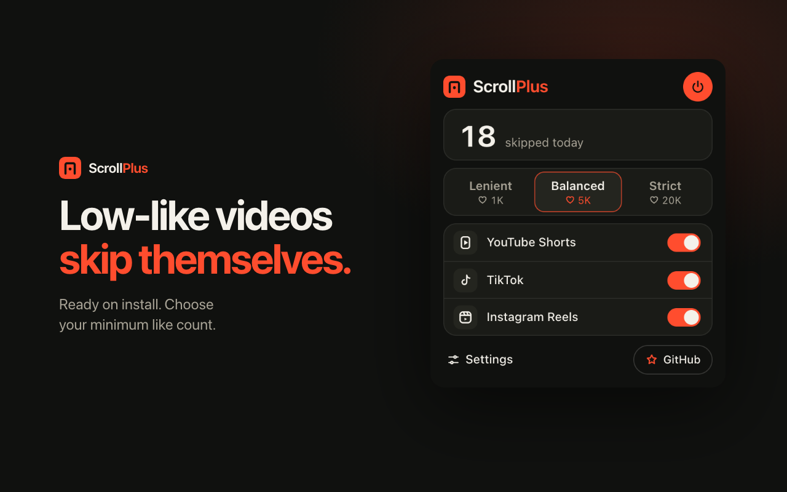
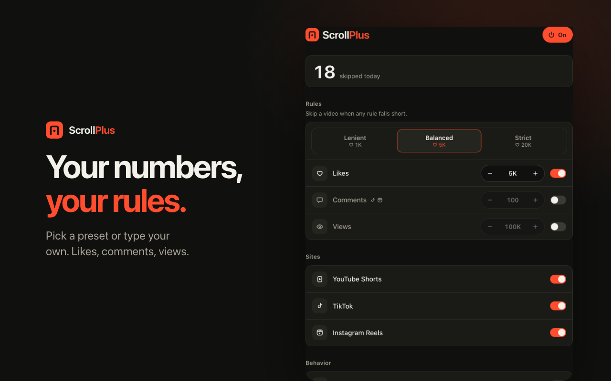
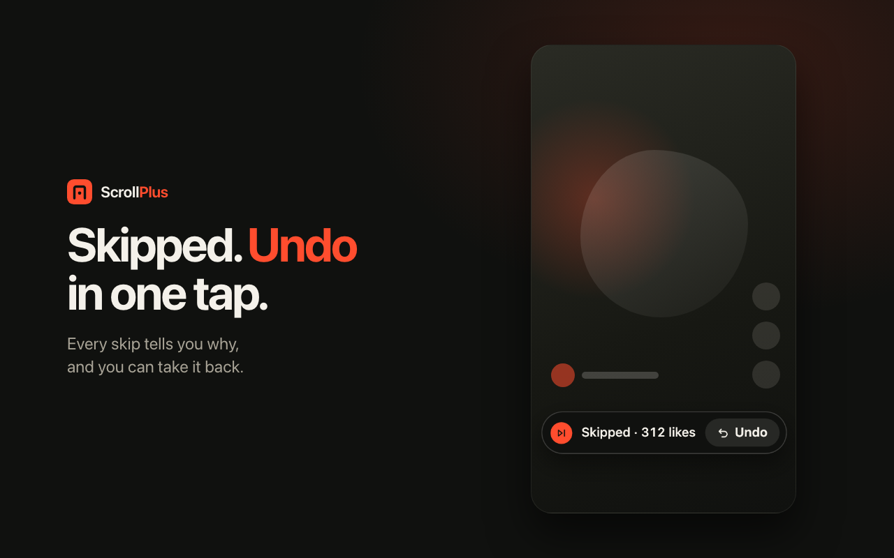

<p align="center"></p>

<h1 align="center">ScrollPlus</h1>

<p align="center"><b>Skip low-like short videos.</b><br>
A Chrome extension that skips YouTube Shorts, TikToks, and Instagram Reels with too few likes.<br>
Installed means on. No account, no setup.</p>

<p align="center"></p>

<p align="center"> </p>

## What it does

Scroll like you always do. When a video has fewer likes than your minimum, ScrollPlus moves to the next one and tells you why, with an Undo that lasts a few seconds.

The default is simple: **skip anything under 5,000 likes**. Pick a different level in the popup, or set your own numbers in Settings.

| Preset | Korean | Skips videos under |
| --- | --- | --- |
| Lenient | 느슨 | 1,000 likes |
| Balanced (default) | 기본 | 5,000 likes |
| Strict | 엄격 | 20,000 likes |

In Settings you can also turn on a minimum for comments or views, switch a site off, and keep creators you like. Numbers can be typed the way you say them: `5k`, `2만`, `1,000`.

If a count is missing, the video stays. It never skips on a guess, never hides a feed, and stops after six skips in a row so you can decide to keep going or lower the bar.

Supported: YouTube Shorts, TikTok, and Instagram Reels on the web, in English and Korean.

## Install

It is not on the Chrome Web Store yet. To try it:

```bash
git clone https://github.com/jeongjin0/scrollplus.git
cd scrollplus
npm install
npm run build
```

Open `chrome://extensions`, turn on Developer mode, choose Load unpacked, and select `.output/chrome-mv3`. Chrome 120 or newer.

## Develop

```bash
npm test           # rule and number tests
npm run test:e2e   # skip engine on a fixture page, popup and options in a real extension
npm run compile    # type check
npm run dev        # live reload
npm run assets     # re-render the store images
```

The product rules are in [SPEC.md](SPEC.md). QA notes are in [qa/](qa). Contributions are welcome, see [CONTRIBUTING.md](CONTRIBUTING.md).

## Privacy

ScrollPlus reads the counts the page has already loaded and decides on your device. Settings and today's skip count stay in Chrome storage. Nothing is collected or sent anywhere. See [PRIVACY.md](PRIVACY.md).

ScrollPlus is not affiliated with YouTube, TikTok, or Instagram.

## License

[MIT](LICENSE). If it saves you some scrolling, a ⭐ on this repo helps other people find it.
