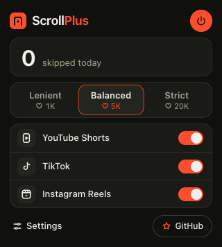
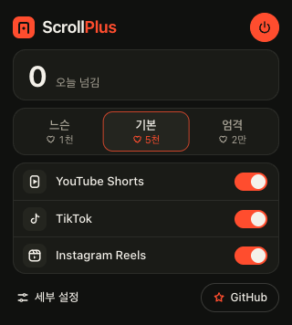
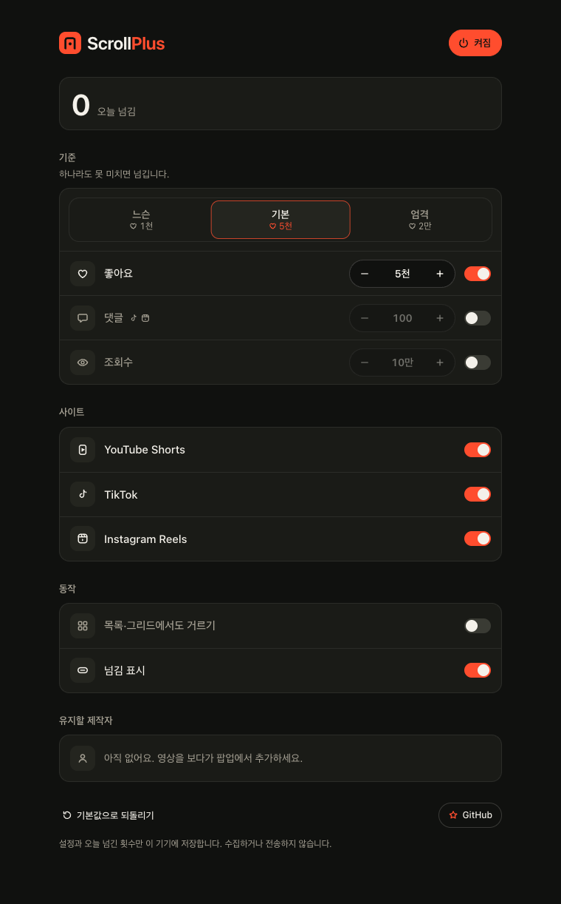
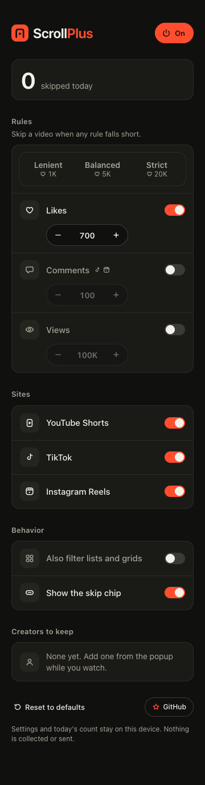

# UI audit · 0.3.1

2026-10-07. Screenshots were captured from the built extension before reviewing the flows. English and Korean use the actual bundled message dictionaries through an explicit `chrome.i18n` test override, because this macOS browser follows the OS language. This checks both translations and layouts; it does not independently prove Chrome's locale selection on every OS.

## Checked flows

1. Fresh install → popup → choose a preset or switch a site. The default is on, with a 5,000-like minimum. Site rows contain the icon, name and switch. Thresholds appear with presets rather than being repeated below each site. GitHub is a quiet footer action.

Both popups measure 320 × 356 CSS pixels. At 1x and 2x they fit without scrolling; browser tests also cover the optional creator and signed-out rows.

2. Settings → enable a rule → enter a count → leave the field. Enabled metrics use independent hard minimums; any known count below an enabled minimum skips the video. Missing counts stay. Disabled rules are visibly muted. Controls have metric-specific accessible names and larger click targets.

3. Edit a number → press Escape, or enter an invalid value. Escape now cancels the draft. Invalid text stays visible with an inline, announced error and does not silently replace the saved minimum. A valid custom count clears the preset selection. These paths are covered by browser tests.

4. Narrow settings at 360 CSS pixels. The number controls wrap underneath the metric title and switch; the Comments label no longer overlaps the stepper. The capture uses a custom minimum of 700 likes. Neither language has horizontal overflow.

5. Skip chip → Undo / six-skip pause → Continue or Lower. The focused chip button is preserved during polling. Undo restores the skipped item, and resuming after a long pause starts a fresh decision window. These paths are tested in engine and built-script fixtures; YouTube Undo was also verified on a real feed.

## Findings resolved

| Finding | Resolution |
| --- | --- |
| Escape committed a number because blur ran afterward | Cancel the blur commit and retain the saved count |
| Invalid input silently reverted | Keep the draft with `aria-invalid` and an associated error |
| English Comments overlapped at narrow widths | Reflow metric rows below 480px |
| Small switches and duplicate stepper names | Larger hit targets; metric-specific names and labelled groups |
| Polling replaced paused-chip buttons and lost focus | Reuse an unchanged chip model |
| Korean labels could show English compact numbers | Format numbers using the actual message locale |
| Creator confirmation appeared before persistence | Wait for storage; show already-kept and failed states accurately |

No unresolved overlap or overflow was found in these captures. This is a scoped product/keyboard audit, not a full screen-reader or accessibility-conformance certification. Signed-in site flows remain the separate gates in [release-readiness.md](release-readiness.md).

Reproduce with `npm run build` followed by `node scripts/capture-ui.mjs`; raw reports and additional Custom/2x captures stay in `qa/tmp/`.
